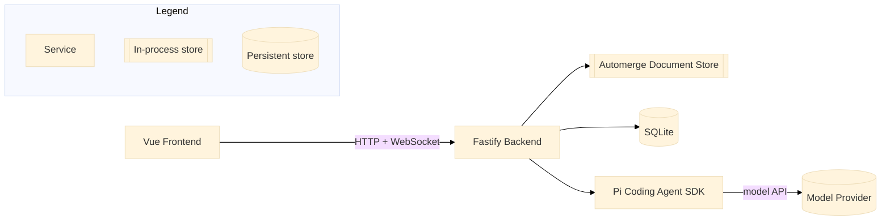

# Rapid AI Document Review

A self-hosted, single-user application for rapid-reviewing a Markdown document while holding multiple concurrent, branching conversations with an AI agent. The application owns the document and its history; the agent proposes edits that the user previews, accepts, or drops before they ever touch the document.

---

## Architecture

The Vue frontend talks to a Fastify backend over HTTP and WebSocket. The backend owns document state (Automerge CRDT, persisted to SQLite) and drives agent conversations through the Pi Coding Agent SDK, which in turn calls out to a model provider (for example, Anthropic).



The application, not Pi, is authoritative for document content, revisions, and edit acceptance. Pi is authoritative for conversation history and model interaction. See `design.md` for the full technical design and `specs/001-ai-document-review/` for the feature specification, plan, and quickstart validation guide.

---

## UI Layout

The main screen is three columns, left to right: **Preview | Canvas | History** (History only takes
up a column while open). The document itself renders as a floating page inside the Canvas column,
which pans with native browser scroll (mouse wheel, trackpad, or keyboard arrow/Page Up/Page Down
once focused) — there is no zoom in this version.

Each conversation renders as a compact box colocated with the document: Main anchors to the top of
the document, and a conversation branched from a highlighted passage anchors at that passage's
vertical position. Branching a conversation renders the new branch one column further out from the
document per level of branch depth, so the whole structure reads left-to-right as a tree; two
branches off the same parent stack vertically with a visible gap rather than overlapping. Each
message in a conversation defaults to a capped height with its own expand/collapse control, plus a
per-conversation control to expand or collapse every message in that conversation at once. Opening
a conversation's full detail view (composing a message, closing, requesting review, viewing
proposed edits) is reached from its compact box and reuses the same conversation detail view as
before this layout change.

The HUD lives in the top toolbar row (document title on the left, existing undo/redo/shortcuts/help
controls on the right), always visible, listing every conversation ordered by its anchor's distance
from the top of the document (Main always first); clicking an entry scrolls that conversation's box
into view.

Preview's own rendering/behavior and the History panel are unchanged by this layout — only their
column position shifted to make room for the Canvas.

---

## Prerequisites

| Tool | Version | Notes |
|------|---------|-------|
| Node.js | 26.1.0 | Pinned in `.nvmrc` and `package.json` engines; provides the built-in `node:sqlite` module used for persistence. |
| npm | Bundled with Node 26.1.0 | Used for the workspace scripts below. |
| Docker | Latest stable | Only required for the containerised deployment path. |
| Playwright Chromium | Installed via `npx playwright install chromium` | Only required to run the end-to-end test suite. |

> A model provider credential (for example `ANTHROPIC_API_KEY`, consumed by the Pi Coding Agent SDK) is required for live agent conversations. Without one, document creation, editing, and history still work, but agent scenarios fail with `AGENT_UNAVAILABLE`. Setting `RADR_BE_PI_FAKE_SESSIONS=1` runs agent conversations against a deterministic, credential-free fake session instead — this is what `npm test` and the e2e suite use by default.

---

## Installation

```bash
npm install
```

This installs and links the three workspaces: `app/shared`, `app/backend`, and `app/frontend`.

---

## Configuration

The backend reads the following environment variables (`app/backend/src/config.ts`), all prefixed `RADR_BE_` (backend) or `RADR_FE_` (frontend, `app/frontend/vite.config.ts`):

| Variable | Required | Default | Description |
|----------|----------|---------|-------------|
| `RADR_BE_PORT` | No | `3000` | HTTP and WebSocket port. |
| `RADR_BE_HOST` | No | `127.0.0.1` | Must remain `127.0.0.1`. The application is loopback-only by design; any other value fails to start. |
| `RADR_BE_DATABASE_PATH` | No | `./data/document-review.sqlite` | SQLite file location. |
| `RADR_BE_PI_SESSION_STORAGE_PATH` | No | `./data/pi-sessions` | Directory for Pi's JSONL session files. |
| `RADR_BE_PI_CODING_AGENT_DIR` | No | `./data/pi-agent` | Pi's config/credential directory. |
| `RADR_BE_PI_AGENT_MODEL` | **Yes** | none | Pins every new agent conversation to a specific model, in `provider/model` or `provider/model:thinkingLevel` format (e.g. `anthropic/claude-opus-4-5` or `anthropic/claude-opus-4-5:high`). The backend fails fast at startup if this is unset or blank. See precedence note below. |
| `RADR_BE_LOG_LEVEL` | No | `info` | Pino log level. |
| `RADR_BE_PI_FAKE_SESSIONS` | No | unset (disabled) | Set to `1` to use a fake, credential-free agent session instead of a live Pi session — useful for local development and required for the default test suite. |
| `RADR_BE_HUNK_CONTEXT_LINES` | No | `3` | Lines of surrounding document context shown around a proposed-edit hunk in the diff preview. |
| `RADR_FE_BACKEND_PORT` | No | `3000` | Vite dev-server proxy target — must match `RADR_BE_PORT`. |
| `RADR_FE_HOST` | No | `127.0.0.1` | Vite dev-server bind host. |
| `RADR_FE_PORT` | No | `3001` | Vite dev-server port. |
| `ANTHROPIC_API_KEY` | Only for live agent use | none | Model provider credential consumed by the Pi Coding Agent SDK. Not read by the application directly; without it, agent conversations are unavailable. |

### Model configuration precedence

`RADR_BE_PI_AGENT_MODEL` is required — the backend fails fast at startup with an error identifying the problem if it is unset, blank, or set to a value that cannot be parsed or resolved. Once resolved, it is applied alongside the per-agent-directory `models.json` (in `RADR_BE_PI_CODING_AGENT_DIR`) as follows:

1. `RADR_BE_PI_AGENT_MODEL` wins for every newly created agent session in the process.
2. `models.json` custom model definitions (in `RADR_BE_PI_CODING_AGENT_DIR`) are the lookup table that `RADR_BE_PI_AGENT_MODEL`'s `provider/model` value resolves against.

---

## Running Locally

The devcontainer at `.devcontainer/` provisions Node 26.1.0, the GitHub CLI, and the `claude`, `uv`, and `pi` CLIs, and is the primary way to get a consistent environment. Open the repository in the devcontainer, then run the commands below inside it.

Without the devcontainer, ensure Node 26.1.0 is installed locally instead.

```bash
export GEMINI_API_KEY=
export RADR_BE_PI_AGENT_MODEL=google/gemini-3.5-flash-lite
export RADR_BE_HOST=0.0.0.0
export RADR_FE_HOST=0.0.0.0
export RADR_BE_PORT=4000
export RADR_FE_BACKEND_PORT=4000
export RADR_FE_PORT=4001

# 1. Install dependencies
npm install

# 2. Create the SQLite database and apply the schema
npm run db:migrate

# 3. Start the backend (watch mode)
npm run dev

# 4. In a second terminal, start the frontend dev server
npm run dev:frontend

# To debug pi agent
export PI_CODING_AGENT_DIR=./app/backend/data/pi-agent 

pi --model $RADR_BE_PI_AGENT_MODEL --session ./app/backend/data/pi-sessions/<doc>/<session-id>.jsonl
```

Open `http://127.0.0.1:3001`. The Vite dev server proxies `/api` and `/events` to the backend on port 3000. With no document created yet, the paste screen appears.

---

## Deployment

```bash
docker compose -f docker/docker-compose.yml up --build
```

This builds the frontend and backend, serves the built frontend from the backend at `http://127.0.0.1:3000`, and persists `RADR_BE_DATABASE_PATH` and `RADR_BE_PI_SESSION_STORAGE_PATH` to the `app-data` volume so the document, revisions, and conversations survive a container restart. The published port is bound to `127.0.0.1` only. `RADR_BE_PI_AGENT_MODEL` must be supplied (e.g. via a `.env` file next to `docker-compose.yml`) since it is required.

---

## Testing

```bash
# All unit, integration, and contract tests (no provider credential required)
npm test

# Individually
npm run test:unit
npm run test:integration
npm run test:contract

# Contract tests against a real Pi session (needs a provider credential)
npm run test:contract:live

# End-to-end tests (Playwright; installs its own backend + frontend dev servers)
npm run test:e2e
npm run test:e2e -- --grep "US3"
```

`npm test` and `npm run test:e2e` run entirely against `RADR_BE_PI_FAKE_SESSIONS`-backed agent sessions and pass without any model provider credential. See `specs/001-ai-document-review/quickstart.md` for the full set of manual validation scenarios, one per user story.

---

## Resetting the application

1. Stop the backend.
2. Delete `rm app/backend/data/document-review.sqlite*`, plus optionally `app/backend/data/pi-sessions/<docId>/`
3. Restart the backend (`npm run dev`) — with no document present, the frontend shows the paste screen again.

## Project Structure

```
rapid-ai-document-review/
├── app/
│   ├── shared/     # Zod contracts (HTTP, WebSocket events, agent tools) and domain types shared by backend and frontend
│   ├── backend/     # Fastify + WebSocket server: document/CRDT store, SQLite storage, conversation and edit services, Pi integration
│   └── frontend/     # Vue 3 + Vite app: Markdown editor, live preview, conversation HUD, diff review
├── docker/          # Production Dockerfile and docker-compose.yml
├── .devcontainer/   # Development container definition
├── tests/e2e/       # Playwright end-to-end specs, one per user story
├── specs/001-ai-document-review/  # Feature spec, plan, data model, contracts, and quickstart guide
└── design.md        # Full technical design document
```

---

## Troubleshooting

**Agent conversations fail with `AGENT_UNAVAILABLE`**

No model provider credential is configured. Set `ANTHROPIC_API_KEY` (or another provider credential supported by the Pi Coding Agent SDK) for live use, or set `RADR_BE_PI_FAKE_SESSIONS=1` to develop against a fake agent session without one.
