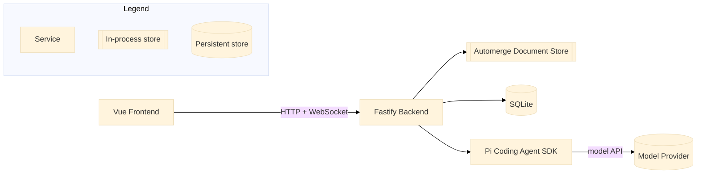

# Rapid AI Document Review

A self-hosted, single-user application for rapid-reviewing a Markdown document while holding multiple concurrent, branching conversations with an AI agent. The application owns the document and its history; the agent proposes edits that the user previews, accepts, or drops before they ever touch the document.

---

## Architecture

The Vue frontend talks to a Fastify backend over HTTP and WebSocket. The backend owns document state (Automerge CRDT, persisted to SQLite) and drives agent conversations through the Pi Coding Agent SDK, which in turn calls out to a model provider (for example, Anthropic).



The application, not Pi, is authoritative for document content, revisions, and edit acceptance. Pi is authoritative for conversation history and model interaction. See `design.md` for the full technical design and `specs/001-ai-document-review/` for the feature specification, plan, and quickstart validation guide.

---

## Prerequisites

| Tool | Version | Notes |
|------|---------|-------|
| Node.js | 26.1.0 | Pinned in `.nvmrc` and `package.json` engines; provides the built-in `node:sqlite` module used for persistence. |
| npm | Bundled with Node 26.1.0 | Used for the workspace scripts below. |
| Docker | Latest stable | Only required for the containerised deployment path. |
| Playwright Chromium | Installed via `npx playwright install chromium` | Only required to run the end-to-end test suite. |

> A model provider credential (for example `ANTHROPIC_API_KEY`, consumed by the Pi Coding Agent SDK) is required for live agent conversations. Without one, document creation, editing, and history still work, but agent scenarios fail with `AGENT_UNAVAILABLE`. Setting `PI_FAKE_SESSIONS=1` runs agent conversations against a deterministic, credential-free fake session instead — this is what `npm test` and the e2e suite use by default.

---

## Installation

```bash
npm install
```

This installs and links the three workspaces: `packages/shared`, `packages/backend`, and `packages/frontend`.

---

## Configuration

The backend reads the following environment variables (`packages/backend/src/config.ts`). All have working defaults for local development; only set what you need to change.

| Variable | Required | Default | Description |
|----------|----------|---------|-------------|
| `PORT` | No | `3000` | HTTP and WebSocket port. |
| `HOST` | No | `127.0.0.1` | Must remain `127.0.0.1`. The application is loopback-only by design; any other value fails to start. |
| `DATABASE_PATH` | No | `./data/document-review.sqlite` | SQLite file location. |
| `PI_SESSION_STORAGE_PATH` | No | `./data/pi-sessions` | Directory for Pi's JSONL session files. |
| `PI_CODING_AGENT_DIR` | No | `./data/pi-agent` | Pi's config/credential directory. |
| `LOG_LEVEL` | No | `info` | Pino log level. |
| `PI_FAKE_SESSIONS` | No | unset (disabled) | Set to `1` to use a fake, credential-free agent session instead of a live Pi session — useful for local development and required for the default test suite. |
| `ANTHROPIC_API_KEY` | Only for live agent use | none | Model provider credential consumed by the Pi Coding Agent SDK. Not read by the application directly; without it, agent conversations are unavailable. |

Secrets and credentials must never be committed to version control.

---

## Running Locally

The devcontainer at `.devcontainer/` provisions Node 26.1.0, the GitHub CLI, and the `claude`, `uv`, and `pi` CLIs, and is the primary way to get a consistent environment. Open the repository in the devcontainer, then run the commands below inside it.

Without the devcontainer, ensure Node 26.1.0 is installed locally instead.

```bash
# 1. Install dependencies
npm install

# 2. Create the SQLite database and apply the schema
npm run db:migrate

# 3. Start the backend (watch mode)
npm run dev

# 4. In a second terminal, start the frontend dev server
npm run dev:frontend
```

Open `http://127.0.0.1:3001`. The Vite dev server proxies `/api` and `/events` to the backend on port 3000. With no document created yet, the paste screen appears.

---

## Deployment

```bash
docker compose -f docker/docker-compose.yml up --build
```

This builds the frontend and backend, serves the built frontend from the backend at `http://127.0.0.1:3000`, and persists `DATABASE_PATH` and `PI_SESSION_STORAGE_PATH` to the `app-data` volume so the document, revisions, and conversations survive a container restart. The published port is bound to `127.0.0.1` only.

---

## Testing

```bash
# All unit, integration, and contract tests (no provider credential required)
npm test

# Individually
npm run test:unit
npm run test:integration
npm run test:contract

# Contract tests against a real Pi session (needs a provider credential)
npm run test:contract:live

# End-to-end tests (Playwright; installs its own backend + frontend dev servers)
npm run test:e2e
npm run test:e2e -- --grep "US3"
```

`npm test` and `npm run test:e2e` run entirely against `PI_FAKE_SESSIONS`-backed agent sessions and pass without any model provider credential. See `specs/001-ai-document-review/quickstart.md` for the full set of manual validation scenarios, one per user story.

---

## Project Structure

```
rapid-ai-document-review/
├── packages/
│   ├── shared/     # Zod contracts (HTTP, WebSocket events, agent tools) and domain types shared by backend and frontend
│   ├── backend/     # Fastify + WebSocket server: document/CRDT store, SQLite storage, conversation and edit services, Pi integration
│   └── frontend/     # Vue 3 + Vite app: Markdown editor, live preview, conversation HUD, diff review
├── docker/          # Production Dockerfile and docker-compose.yml
├── .devcontainer/   # Development container definition
├── tests/e2e/       # Playwright end-to-end specs, one per user story
├── specs/001-ai-document-review/  # Feature spec, plan, data model, contracts, and quickstart guide
└── design.md        # Full technical design document
```

---

## Troubleshooting

**Agent conversations fail with `AGENT_UNAVAILABLE`**

No model provider credential is configured. Set `ANTHROPIC_API_KEY` (or another provider credential supported by the Pi Coding Agent SDK) for live use, or set `PI_FAKE_SESSIONS=1` to develop against a fake agent session without one.

**Backend refuses to start with an error about `HOST`**

`HOST` must be `127.0.0.1`. The application is scoped to localhost-only access and does not support network exposure in this version.
