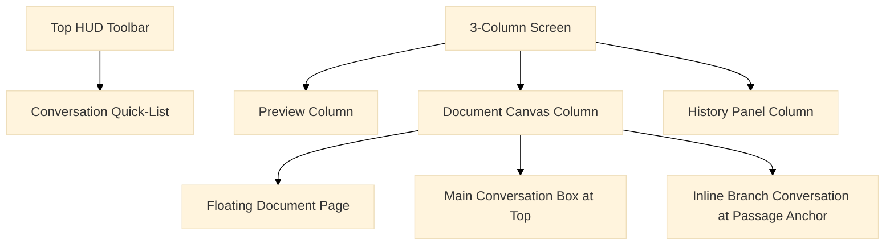

# Frontend UI & Component Layout

The Vue 3 frontend delivers a single-user rapid review experience organized around a document canvas and branching AI chat sessions.

## Layout Structure

## Key UI Components

- **Preview Column**: Renders live Markdown/rendered preview alongside the editing canvas.
- **Canvas Column**: Contains the floating document page that pans with native browser scrolling.
- **Branching Chat Boxes**:
  - Main conversation anchors at the top of the document.
  - Highlighted-passage conversations anchor vertically at their respective line positions.
  - Nesting/branching indents columns left-to-right to display the conversation tree clearly.
- **HUD & Toolbar**: Located in the top row, displaying the document title, shortcuts, help, and an interactive list of all active conversations ordered by vertical position. Clicking any conversation jumps the canvas directly to its anchor.
