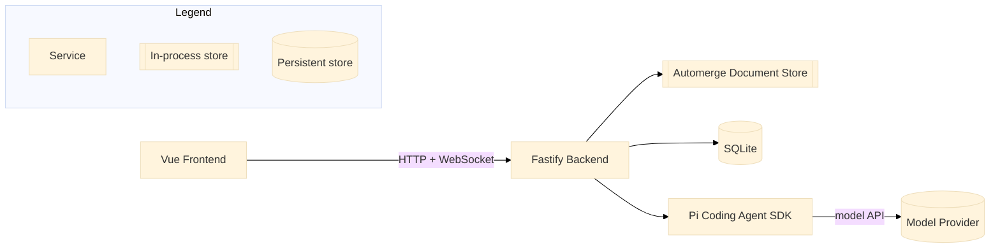

# Rapid AI Document Review

A self-hosted, single-user application for rapid-reviewing a Markdown document while holding multiple concurrent, branching conversations with an AI agent. The application owns the document and its history; the agent proposes edits that the user previews, accepts, or drops before they ever touch the document.

## Architecture Overview

The application, not Pi, is authoritative for document content, revisions, and edit acceptance. Pi is authoritative for conversation history and model interaction.

## UI Layout & Features

- **Three-Column Layout**: Preview | Canvas | History (History toggles as a column).
- **Floating Document Canvas**: Pans with native browser scroll; no zoom in this version.
- **Branching Conversations**: Main anchors to the top of the document; inline conversations anchor to highlighted passages at their vertical position. Branch depth indents columns left-to-right.
- **HUD & Navigation**: Top toolbar row with document title, controls, and a listing of every conversation ordered by anchor distance; clicking an entry scrolls to that conversation box.

## Workspaces & Technical Stack

- **Monorepo Workspaces**:
  - `app/shared`: Shared types, protocol definitions, and utilities.
  - `app/backend`: Fastify API server, SQLite persistence (`node:sqlite`), Automerge CRDT document store, and Pi Coding Agent SDK integration.
  - `app/frontend`: Vue 3 frontend application communicating via HTTP and WebSocket.
- **Key Technologies**: Node.js >= 26.1.0, TypeScript, Fastify, Vue 3, Automerge, SQLite, Playwright.
